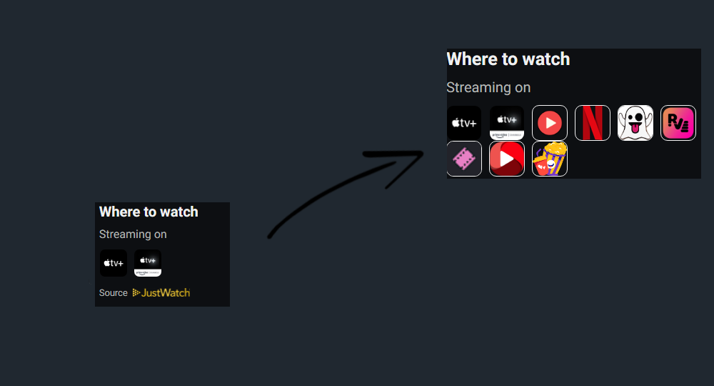

<br />
<p align="center">
  <a href="https://github.com/kim20598/serializd-services.git">
    
  </a>  
  
  <h3 align="center">serializd Services</h3>

  <p align="center">
    serializd Extension that provides you services for shows.
    <br/>
    <br/>

## About The Project

<br />


<br/>

Idea is taken from [here](https://github.com/Hame-daani/letterboxd_util) , [here](https://github.com/pypp/letterboxd-services/).

serializd Services is a Chrome extension that will make it easier by providing you with free services for tv shows straight through [serializd](https://serializd.com/) page

## Installation

If you are using Chrome you can download the extension straight from the Chrome Web Store [serializd-services](https://github.com/kim20598/serializd-services.git).  
If you are not using chrome or you don't want to install it from the Chrome Web Store, you can also install it [manually](#manual-installation).

## Manual Installation

1. Clone the repo

   ```sh
   git clone https://github.com/kim20598/serializd-services.git
   ```

### Chrome

2. Open Chrome and go to **chrome://extensions**

3. Toggle on **Developer mode** checkbox in the top right-hand corner.

4. Click the **Load unpacked extension** button and select the folder **extension**.

### Firefox

NOTE: If you are using Firefox version < 109 the extension won't work for you

2. Open Firefox and go to **about:debugging#addons**

3. Click **Temporary Extensions**

4. Click the **Load Temporary Add-on…** and select the **manifest.json** file from the folder **extension**.

5. Go to **about:addons**, find the extension, click on the **Permissions** tab, toggle on the optional permission.

## Contributing

Pull requests and issues are welcome.
